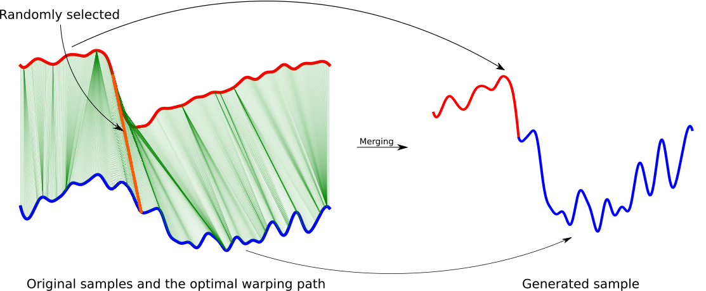

# DTW-Merge: A Novel Data Augmentation Technique for Time Series Classification


In this project, a new method for data augmentation is proposed called DTW-Merge. This method is based on Dynamic Time Warping (DTW), which is a well-known tool for aligning time series. We examine the proposed data augmentation method with the ResNet on all datasets of the UCR TSC benchmark. The experiments show that DTW-Merge could considerably improve the results compared to when no augmentation is used. The overview of the method is depicted below.



## Usage


The UCR Time Series Classification Archive could be downloaded from [here](https://www.cs.ucr.edu/%7Eeamonn/time_series_data_2018/). Then follow these steps.

- Install required packages by running "pip install -r requirements.txt".

- Put all files (including datasets folder) in the same folder, then run "main.py".

The output will be a file that contains the accuracy for each dataset. You can find the detailed results in the "UCR_results.csv" file provided. The mentioned file contains error rate of each dataset.

This code will be run on the CPU. If you want to run it on GPU, you need to make some adjustments. I prefer to use Anaconda package manager and install 'tensorflow-gpu'.

For running grad-CAM, TensorFlow version 2.2.0 is needed.


## Citation


In case of finding this code helpful, please cite [this paper.](https://arxiv.org/abs/2103.01119)

```
{
@misc{akyash2021dtwmerge,
      title={DTW-Merge: A Novel Data Augmentation Technique for Time Series Classification}, 
      author={Mohammad Akyash and Hoda Mohammadzade and Hamid Behroozi},
      year={2021},
      eprint={2103.01119},
      archivePrefix={arXiv},
      primaryClass={cs.LG}
}
``` 

## contact


If you have any question and comment, please don't hesitate to contact [Mohammad Akyash](mailto:mh_akyash@yahoo.com).